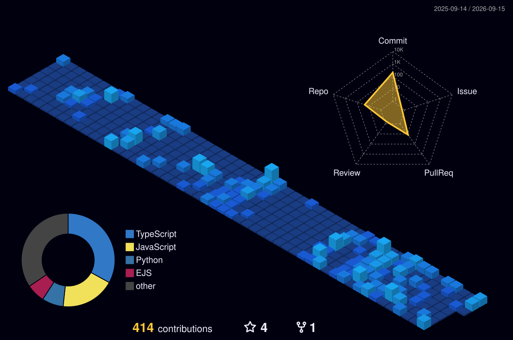
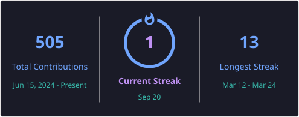
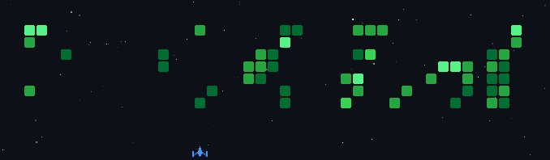
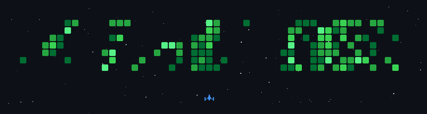

  

---

### 🌐 Connect With Me

  
  
  
  

---

### 💡 About Me

> 👨‍💻 Passionate about building full-stack web apps that solve real-world problems  
> 🤖 Exploring AI/ML and Agentic AI systems  
> 🌱 Currently learning *Next.js, FastAPI, and Machine Learning*  
> 🧠 Interested in *DSA, Open Source, and Web + AI Integrations*  
> 🎯 Goal: Build impactful, scalable, and intelligent applications.

  

---

### 📄 Resume

&nbsp; &nbsp;
<!--  -->

 
---

### 🧰 Tech Stack

#### 💻 Frontend

  
  
  
  
  
  
  

#### ⚙ Backend

  
  
  
  

#### 🗃 Databases

  
  
  
  

#### 🧩 Languages, Tools & Platforms

  
  
  
  
  
  
  
  

<!---

### 🧮 Competitive Programming Journey

| Platform | Rating | Problems Solved | Achievements |
|-----------|--------|-----------------|--------------|
| 💻 [LeetCode](https://leetcode.com/u/Amandot/) | Intermediate | 100+ | Global Rank ~1290k |-->

---

### 📊 GitHub Stats

  <!--  -->
  <!--  -->
  <!--

-->
  
   

<!-- 

  

 -->

<!-- 

  

 -->

---

<!--

  

 -->

  

